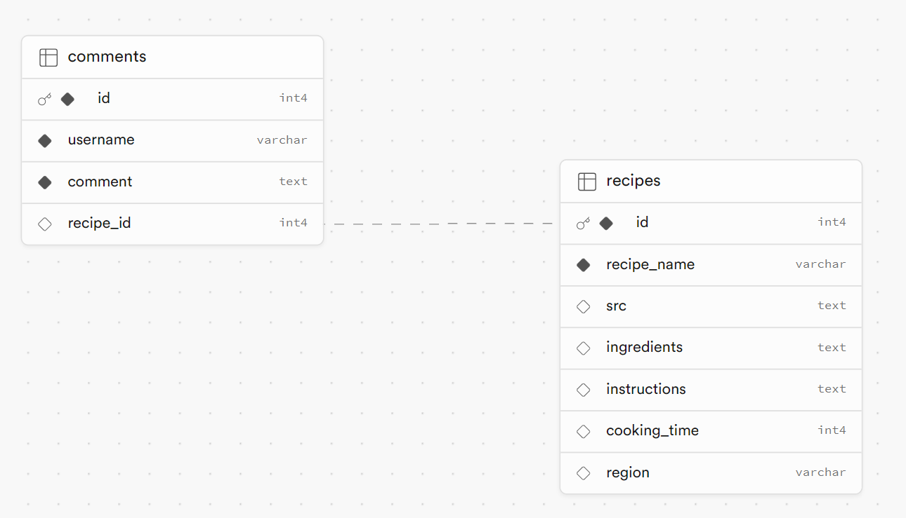

### What does the site do?

I designed a full stack site that displays food recipes. It allows users to post comments on recipes and to add their own recipes.

### Requirements

- 🎯 Create a client using React. - done
- 🎯 Use Express to create your server, using both GET and POST endpoints. - done
- 🎯 Build a React form for users to create posts. - done
- 🎯 Create multiple pages using React Router. - done
- 🎯 Design a database schema, and seed the database with some realistic data. - done
- 🎯 Use SQL to retrieve posts from the database in your Express server. - done
- 🎯 Display all posts using .map(). - done

### Stretch Requirements

- 🏹 Create dynamic pages using react-router-dom.
- 🏹 Use react-router-dom to create a dedicated route for the categories
  - For example, `/posts/:categoryName`. - not done
- 🏹 Allow users to delete posts. - not quite
- 🏹 Add ‘like’ functionality on posts. - not done
- 🏹 Create additional SQL queries to show filtered posts. - done
- 🏹 use more then one table. - done

### What went well

I completed all of the requirements and a couple of the stretch goals. The site is functioning and works well. I'm pleased I managed to add the ability to add comments, although the user does need to provide the recipe id for the comment.
I managed to get the delete endpoint to work in the server and tested it on thunderclient. However I wasnt quite sure how to make it work in the client. Specifically how to feed the id to the server.

### What I found difficult

There were a number of things i struggled with in this weeks assignment. - My PostsPage.jsx component is very long and convoluted, due to having a very large map function to render the page. Also having maps within maps in fact. I'm sure I could have done this better but didn't know how to break it down into smaller components - The why I implemented adding comments was not quite as it should be. How do I provide the id to the server in a better way? I believe if i solve this i can get my delete and like to work too - My styling could be better. It was unfortunately rushed as I spent too long trying to make some of the stretch goals work
